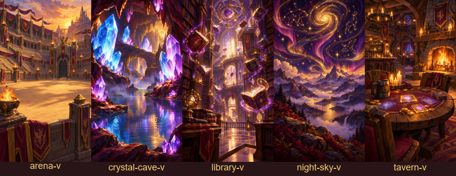
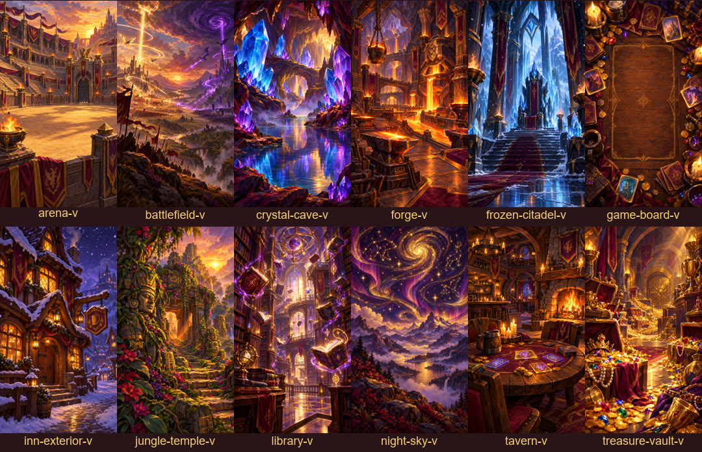
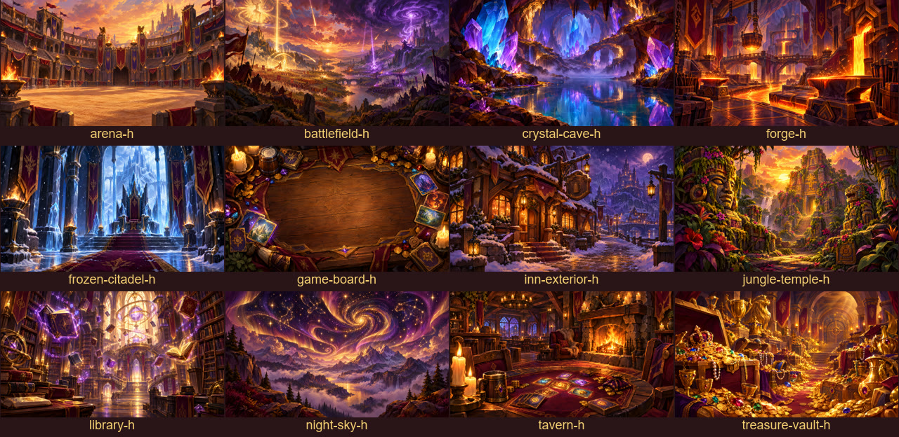
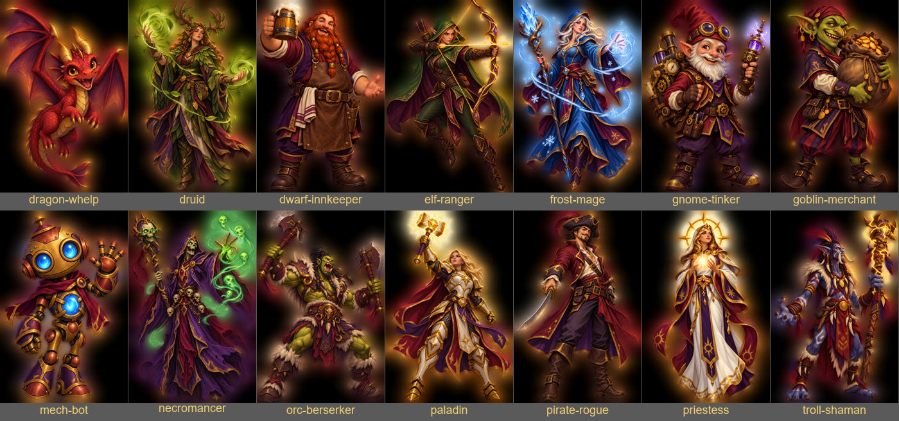
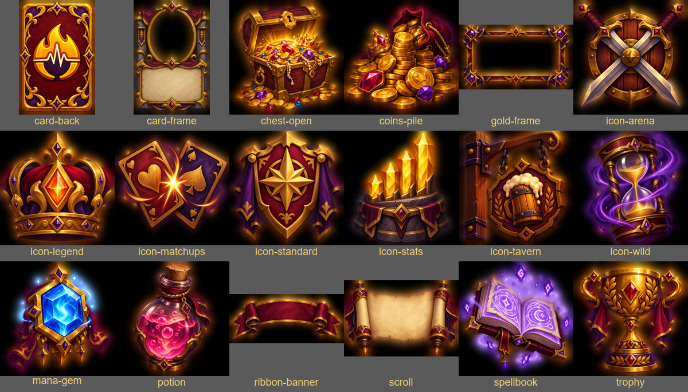
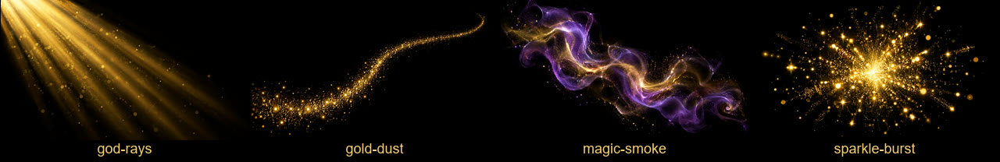

# Библиотека ассетов HearthPulse

Сгенерирована в Higgsfield 29.09.2026 для будущих роликов. Всё в едином оригинальном стиле «уютной коллекционной карточной игры» в палитре бренда (бордо, золото, фиолетовые акценты), **без персонажей и артов Blizzard**. Поэтому эти ассеты можно оживлять в Higgsfield без отказов по авторским правам и использовать в рекламе как свои.

**Область:** фэнтези-таверна, Hearthstone — реклама и обзоры HearthPulse и YouTube Манакоста (музыкальные подложки, фон таверны и шумовая отделка «Компендиума»). Для другой игры (LoL и т. п.) эта библиотека не подходит: у нового направления своя библиотека и свой каталог в игровом наборе (заводит навык `studio-new-direction`). Световые эффекты и искры — с учётом вкуса направления (`taste/`): в YouTube Манакоста они отвергнуты, для рекламы — открытый вопрос.

- Файлы: `public/lib/…`
- Промпты, модели, размеры: `public/lib/manifest.json`
- Компоненты и имена для кода: `src/hearthpulse/library.tsx`
- Видео-витрина: композиции `Library-Showcase` (9:16) и `Library-Showcase-16x9` в студии рекламы (`npm run studio:ads`)
- Листы превью пересобираются скриптом `scripts/library-sheets.ps1`
- Догенерировать недостающее или расширить библиотеку: дописать в `scripts/gen-library.mjs` и запустить `node scripts/gen-library.mjs` (готовые файлы пропускаются)

## Живые фоны (9:16, 1080p, 30 fps, цикл 136 кадров ≈ 4,5 с без шва)



`tavern`, `arena`, `library`, `crystal-cave`, `night-sky`. Циклы есть только в вертикали; в 16:9 `LibBackdrop` сам подставляет горизонтальную картинку той же локации с медленным наездом.

```tsx
// Как живой фон сцены функции (повторяется на любую длину сцены)
backdrop: {art: libArt('tavern'), dim: 0.8},
live: libLoop('tavern'),
// Или целиком как фон любой сцены
<LibBackdrop id="tavern" dur={dur} dim={0.6} />
```

## Локации (у каждой вертикальная и горизонтальная версия, ~1520×2688 / 2688×1520)





`tavern`, `arena`, `library`, `crystal-cave`, `forge`, `frozen-citadel`, `jungle-temple`, `night-sky`, `game-board` (пустой центр под интерфейс), `treasure-vault` (для сцен о подписке/цене), `inn-exterior`, `battlefield`

```tsx
backdrop: {art: libArt('treasure-vault'), dim: 0.8}  // ориентация подставится сама
```

## Герои (прозрачный фон, 2:3)



`dwarf-innkeeper`, `elf-ranger`, `orc-berserker`, `gnome-tinker`, `necromancer`, `paladin`, `troll-shaman`, `druid`, `pirate-rogue`, `goblin-merchant`, `frost-mage`, `priestess`, `mech-bot`, `dragon-whelp`

```tsx
char: {v: {src: libChar('dwarf-innkeeper'), h: 900, side: 'right', offset: -150, bottom: -40}, h: {…}}
<LibChar id="paladin" h={800} side="left" offset={40} bottom={-30} />
```

## Предметы и иконки (прозрачный фон)



`card-back` (рубашка с эмблемой HearthPulse), `card-frame`, `gold-frame`, `ribbon-banner` (пустая лента под текст), `chest-open`, `coins-pile`, `mana-gem`, `trophy`, `scroll`, `spellbook`, `potion`, иконки режимов и разделов `icon-arena`, `icon-tavern`, `icon-standard`, `icon-wild`, `icon-legend`, `icon-stats`, `icon-matchups`

```tsx
<LibProp id="chest-open" x={540} y={1500} size={420} delay={b(2)} />
```

Текст на ленте, рамке или свитке всегда кладётся кодом поверх (шрифт HSDisplay), а не рисуется нейросетью.

## Световые эффекты (чёрный фон, накладываются «экраном»)



`sparkle-burst`, `magic-smoke`, `god-rays`, `gold-dust`

```tsx
<LibFx id="sparkle-burst" at={FINAL_HIT} len={30} />   // вспышка на ударе музыки
```

## Музыка (`public/lib/music`)

| Трек | Длина | Для чего |
|---|---|---|
| `epic-45` | 45 с | длинная реклама, трейлерная, с финальным ударом |
| `tavern-30` | 30 с | спокойные ролики, фон под обзоры |
| `hype-15` | 15 с | короткие промо и сторис, удар в конце |
| `announce-20` | 20 с | анонс новой функции, финальный удар |
| `mystic-30` | 30 с | загадочное настроение, без барабанов |
| `tavern-30-bed`, `mystic-30-bed` | 30 с | подложки под голос для YouTube Манакоста: те же треки, выровненные (мягкая компрессия, −16 LUFS); их ставит `YT_BASE` в `src/brands/manacost/channel.ts` |

Перед монтажом прогони трек через `node scripts/beats.mjs public/lib/music/<трек>.m4a` и ставь стыки на сильные доли (см. BRAND.md).

## Звуки (`public/lib/sfx`)

`card-draw`, `card-shuffle`, `coin-single`, `coin-pile`, `gem-sparkle`, `level-up`, `magic-whoosh`, `riser`, `drum-hit`, `fanfare`, `notification`, `page-turn`, `scroll-unroll`, `sword-clash`, `fire-crackle`, `tavern-crowd`, `ui-click`, `bell`, `stone-slide`

Шумовая отделка «Компендиума» — собрана `node scripts/foley.mjs` из библиотеки и синтеза, без генерации (кредиты не нужны): `cam-swish` (шорох наезда камеры на карту), `quill-scratch` (росчерк пера под тезисом), `coin-trickle` (монеты под счётчик пыли), `seal-stamp` (стук сургучной печати).

```tsx
[libSfx('coin-single'), START.end + FINAL_HIT, 0.6]   // Cue: файл, кадр, громкость
```

Звуки уже обрезаны по тишине и нормализованы, исходники лежат в `public/lib/sfx/raw`. `notification` и `ui-click` модель выдала почти беззвучными, их пришлось усилить примерно на 35 дБ — проверь на слух перед использованием. Для наведения и кликов в интерфейсе пока надёжнее `public/audio/sfx-pop.wav`.

**Не сгенерированы (кончились кредиты):** `ui-hover` (вышла тишина, файл удалён) и `heartbeat-deep`. Оба уже прописаны в `scripts/gen-library.mjs` — при следующем запуске с кредитами догенерируются сами.

## Фон под всем роликом (`public/lib/amb`)

`tavern-crowd.wav` (гул зала, петля 22 с), `tavern-fire.wav` (камин, петля 17 с) — бесшовные петли для `config.ambience` YouTube-роликов, на ~25 дБ тише голоса. Статус — проба (`taste/manacost-hs.md`).
